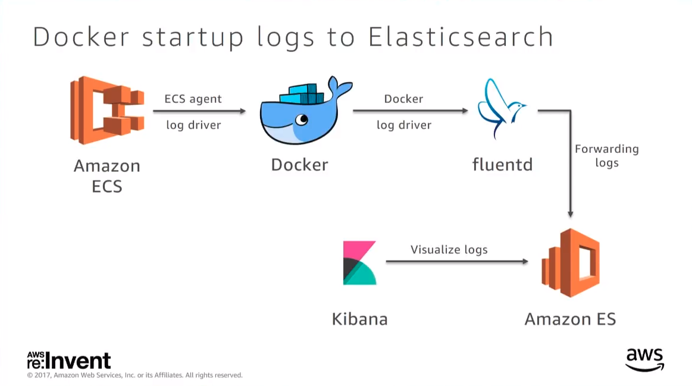
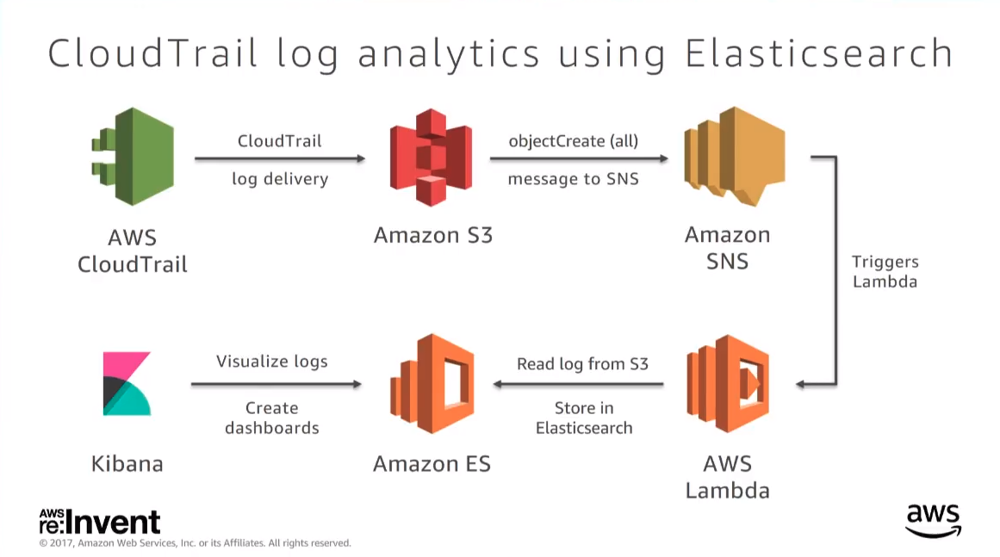
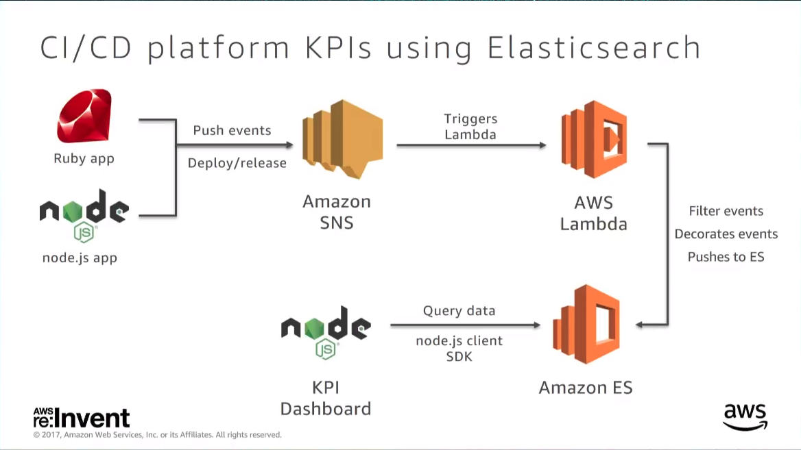

# Amazon Elastic Search

*Speaker: Kuldeep, @this_is_kuldeep*
# Logs analytics at Expedia Using Amazon Elastic Search


- \+150 Clusters (different sizes)
- \+450 EC2 (different sizes)
- \+30TB of data (not more than 3 days)
- \+30 documents


### Why did we choose Amazon ES ?

- It's open source
- User-friendly console
- High availability
-- Security

- Flexible storage options
- VPS
- Monitoring with (CloudWatch)
- backups

*Before amazon it wasn't fully automated*

## Different Log Analytics Architectures

### 1 Docker startup logs to Elasticsearch

Move from EC2 to ECS \
Microservices  use
The logs of Docker were print in the consoles not anywhere else\
**Solution**: write the logs in a file and put this file to the cluster

#### Problem:
    Understand why a particular service is not starting.

Docker 1.7 introduce *docker logger* which is a streaming option for docker logs\
From now then send the logs directly to a streaming service - here we use **Fluent**.

*Architecture:*


This image explains how we get and process our logs.
When we start a cluster on ECS, in the backend it start the docker containers and these containers through docker logger stream the logs to Fluentd, Fluentd forward these logs to Amazon ES for processing and we then visualize the results with Kibana.
From these results, when a container failed to start, we automate a event by sending the Kibana url and all the description to the operator.

FLuentd is like apache flume or kafka.

**Docker fluentd log_driver configuration**
```json
{
    "log_driver": "fluentd",
    "options": {
        "fleuntd-adress": "<fluentd>:24224",
        "tag": "#{ImageNam}"
    }
}
```
The tag is the docker container tag.

**Example of fluentd configuration to receive Docker logs**

```xml
<source>
    @type forward
    port 24224
    bind 0.0.0.0
</source>
    <match *.**>
    @type copy
```
**fluentd to Amazon ES**\
The logs are just forwarded to the elastic search domain

```xml
<match *.**>
    @type copy
    <store>
        @type elasticsearch
        host <elasticsearch domain>
        include_tag_key true
        tag_key @log_name
        flush_interval 1s
    </store>
```


#### 2 cloudtrail log analytics using Amazon ES

CloudTrail records all the api calls made to AWS services and save them in a s3 bucket.\
From theses logs, you can do any processing you can think of. In fact the logs keep trace of "who, where, when, what" of the api call.

> Example of use case at Expedia: Use to tag the EBS volumes. Because whenever a EC2 instance start, there is no option to automatically tag the EBS instances created.
> Can also be used for security purposes: If an unknown IP address where to make a request to your AWS account.

**Problem**:
Expedia owns 3 AWS account and lot of services on each one (ECS, EBS, EC2, etc).\
Expedia would like to know who is making an api call and on which account.

*Architecture:*


So:
Cloud Trail generate the logs and save them to a s3 bucket. From this s3 bucket we set up a SNS listener which trigger at every write. Then a Lambda (AWS Lambda) function is linked to this SNS listener. The lambda function does only one thing which is to forward the data to Amazon ES.

The Lamnda function's code
```python
try:
    response = s3.get_object(Bucket=s3Bucket, key=s3ObjectKey)
    content = gzip.GzipFile(fileobj=StringIO(response['body'].read())).read()
for record in json.loads(content)['Records']:
    recordJson = json.dumps(record)
    logger.info(recordJson)
    indexName = 'ct-' + datetime.datetime.now().strftime("%y-%m-%d")
    res = es.index(index=indexName, doc_type='record', id=record['eventID'], body=recordJson)
    logger.info(res)
return True
```

**Results**
A dashboard with the top 10 api calls within every 10 mins.\
The solution is at
[cloud trail logs analytics](https://github.com/ExpediaDotCom/cloudtrail-log-analytics)
Run with SAM
Serverless Application Model from AWS.


#### - CI/CD platform KPIs using Amazon ES
We use Primer for managing the micro services
+ \+1500 deployments/day all environments
+ \+300 on production

**Problem**: Why a particular service is failing\
Have to fugure out a way to differenciate a user generate issue or a platform issue.

The platform is build on top of *Ruby* and *Node.js* and both send the same event notifications (push event: deploy or realease) to SNS. Once an event is in SNS, a lambda trigger and fetch the data and do some preprocessing.

*Architecture:*



#### - Distributed tracing platform using Amazon ES
Resource for Distributed Tracing
Google: Dapper

#### - Hotel image metadata repository using Amazon ES
Amazon ES is used as ametada repository for hotel images

For an image we have data:

- URL
- Latitude, Longitude
- Width
- Height
- Labels
- Google Vision tags
- Etc.

Once the data is in Amazon Elastic Search, we create a dashboard where we can find for example the number of image with a given "google image tag" (eg: room with bed).

### Things to keep in mind

- Scaling of cluster results in a new cluster with the data beign synchronized
- Monitor and optimize the cluster yourself (Don't just go by the default, optimize it for your need)


*Blogger:
Chriss Santi\
CS Master student at the RUG University
osler.santi@gmail.com*