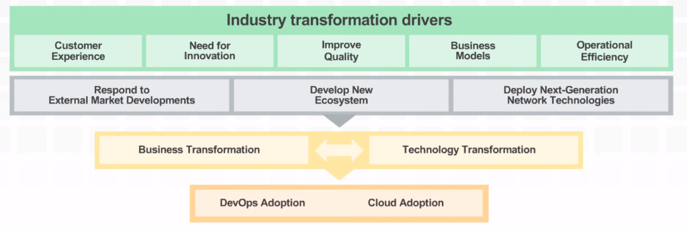
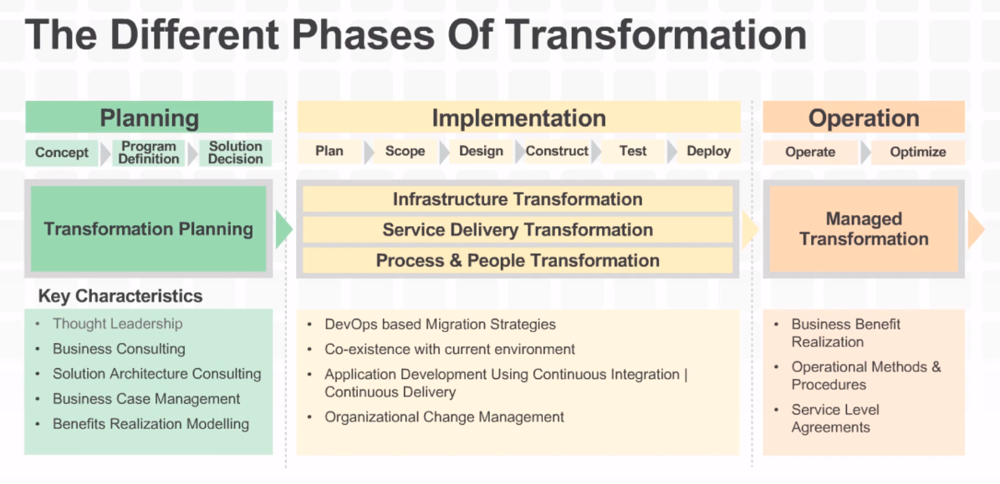

# DevOps on AWS

[video link](https://www.youtube.com/watch?v=071rB05Oj9g&feature=youtu.be)

Tools that enable devops workflow in the cloud

- AWS Code Commit
Store code in Private Git Repositories

- AWS CodeDeploy
Automate Code Deployments

Dploy assets, object artifacts that are compiled

- AWS CodePipeline
Release Software using Continuous Delivery

EC2 (Compute Cloud)
ECS (Docker Management)
AWS Elastic Beanstalk (jar or container)

Amazon API Gateway (secure API's at any scale for microservices, more consumable, discover services faster)
AWS Lambda (Deploy and scale web applications and services, livecycle management (before with cron), now with lambda )

Amazon cloudFront (Global Content Delivery Network (CDN), devliver content to the edge, to the users)

Governance in DevOps
AWS Config (Ressources Inventory in realt time, Configuration history, and Change Notification)

AWS CloudTrail (User activity and AWS API call recording)

Amazon CloudWatch(Monitoring, alarms, and dashboards)

DevOps for Business Transformation at Ellucian
Traditionnal ditionnal ERP suite (what is that ?)

What takes companies from traditionnal software development to DevOps ?

Important steps when we want to operate a transforamation

- Concurrence
- Need of innocation, (Improve quality, Bu)

All images are copiright to AWS